# Karla Gaudet - Portfolio Task

[My portfolio site](https://ktechgau.github.io/)

## Project Requirements

### Content

My portfolio project contains one profile picture as well as several other photos for design and interest purposes. Other features my portfolio contains are: an About page, Contact page, a section showing my projects and links to my instagram and linkedin public profiles.

### Technical

My portfolio contains 3 web pages and deployed on Github. It implements responsive design principles and HTML semantics were used.

### Bonus (optional)

Some bonus features showcased in this portfolio include a hover state (in the nav bar, buttons and all links that lead to external sites) as well as a focus state in the Contacts form fields.
Other bonus features include smooth scroll, CSS creations in the way of shadow boxes (in the portfolio section) and a neon effect in the hero section's heading and in the portfolio section.

### Screenshots

#### Mobile Views

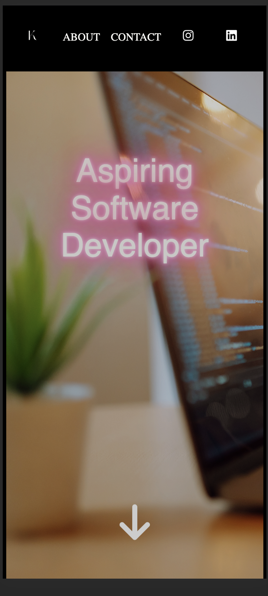

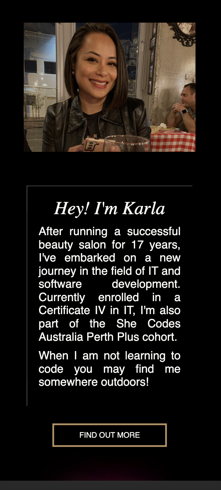

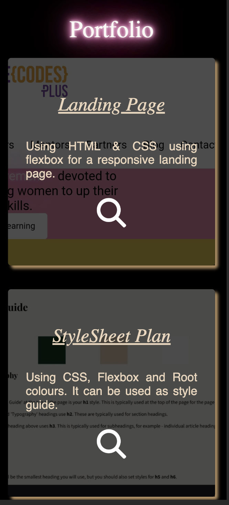

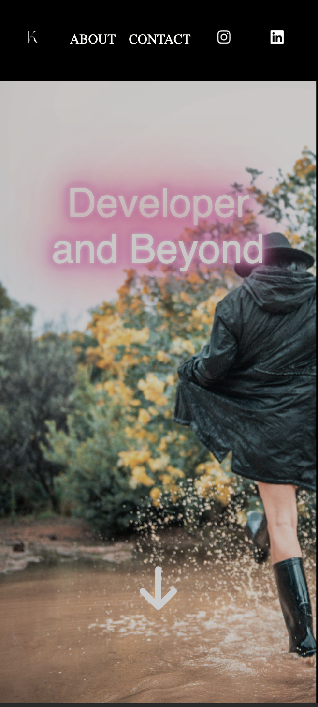

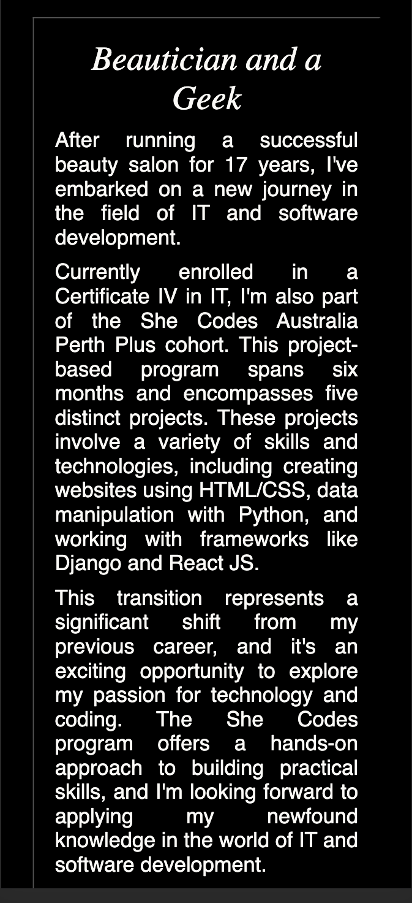

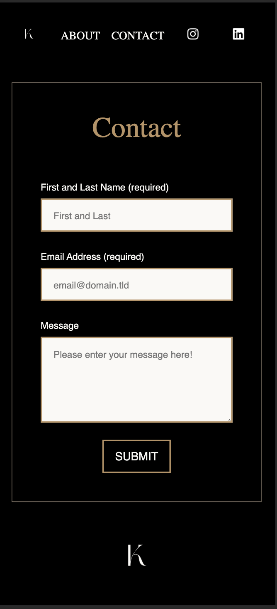

#### Table Views

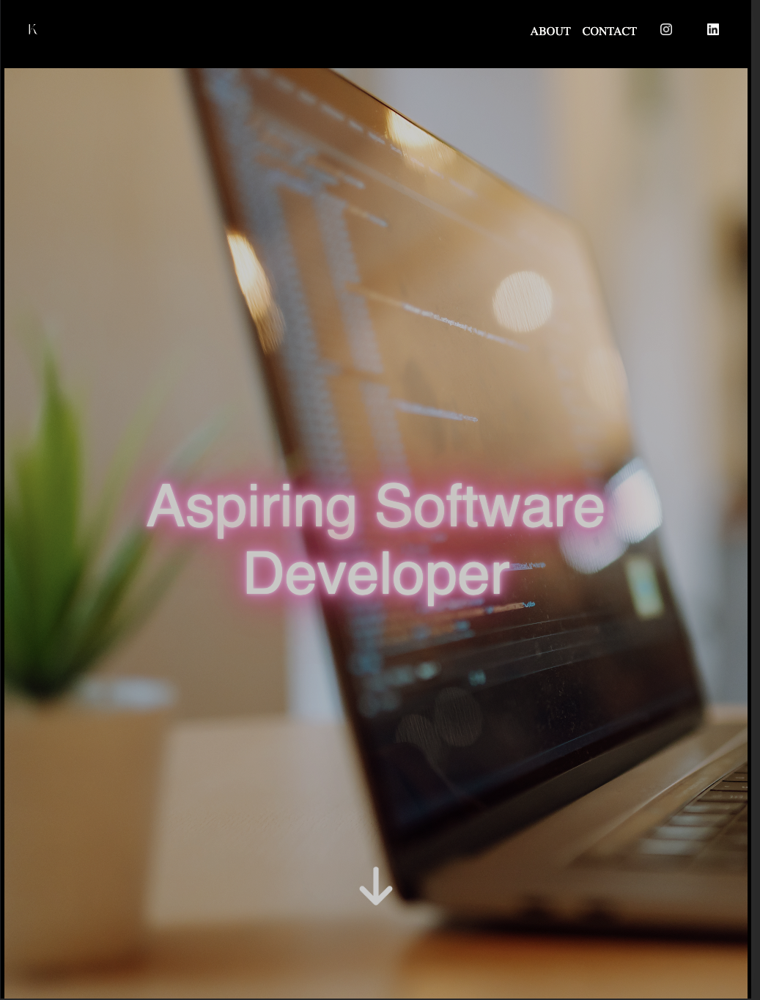

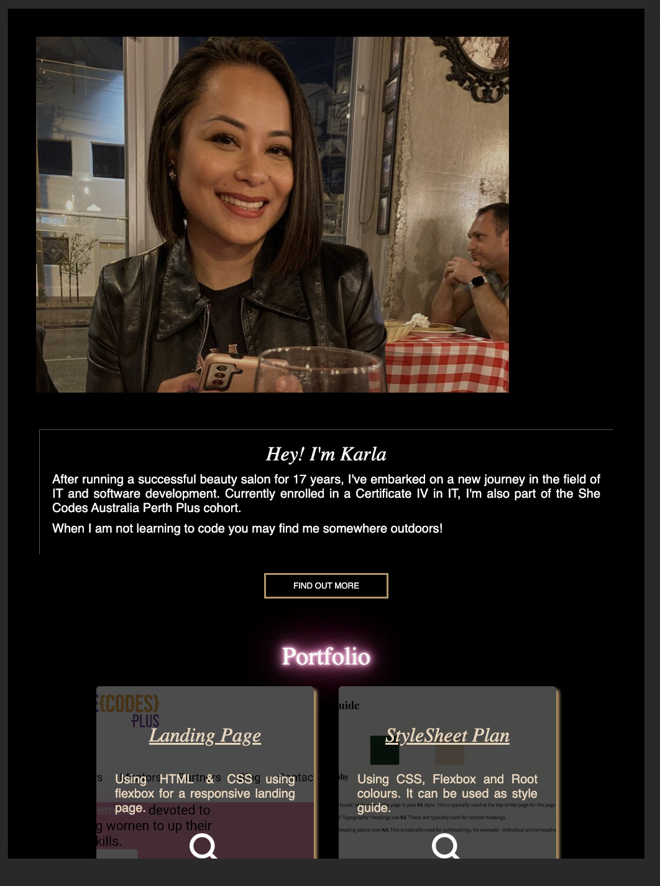

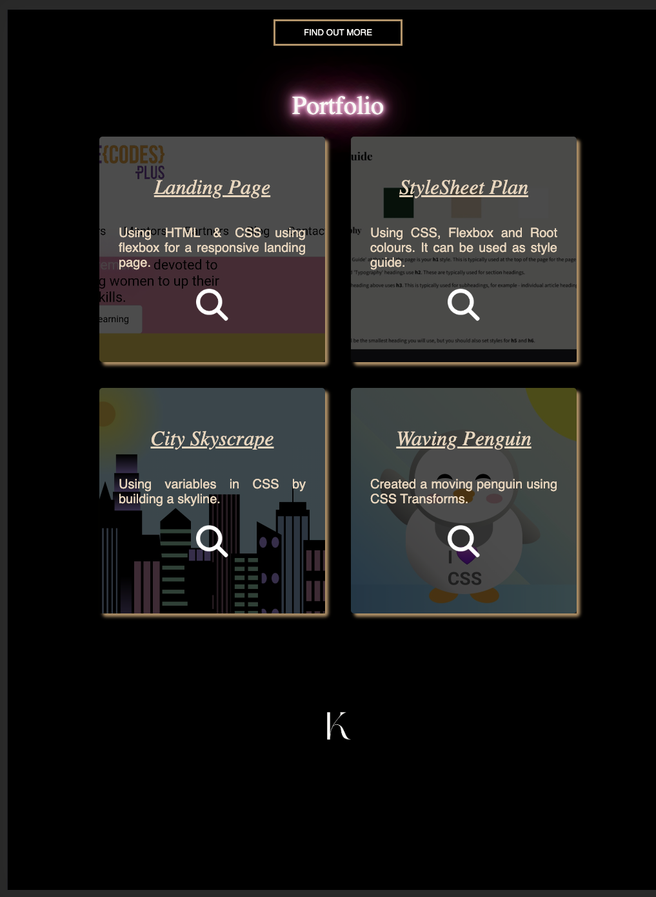

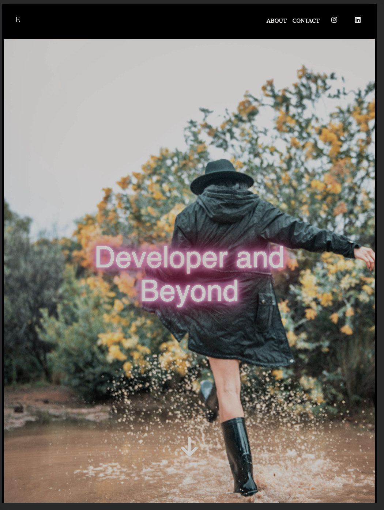

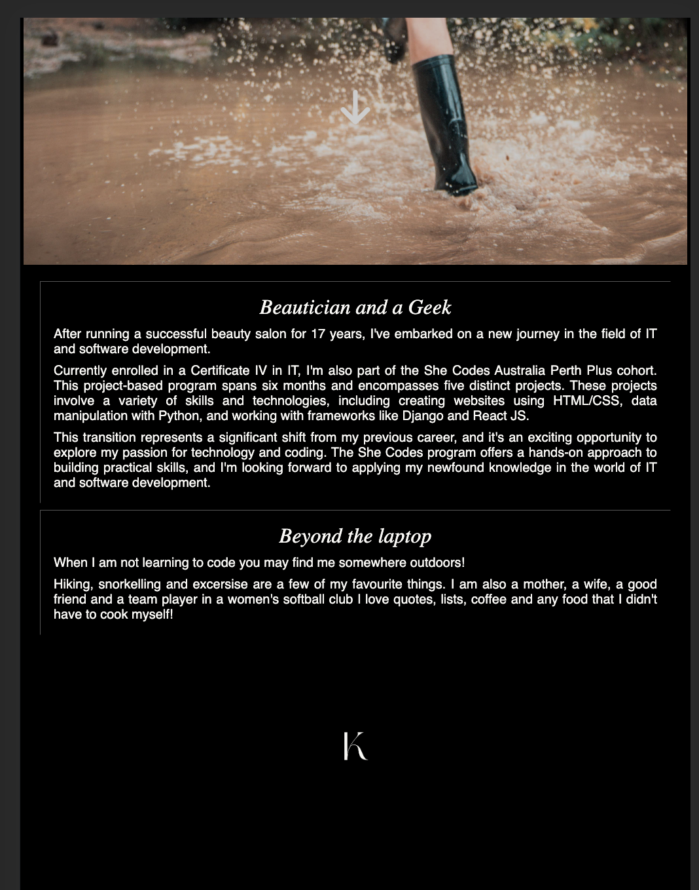

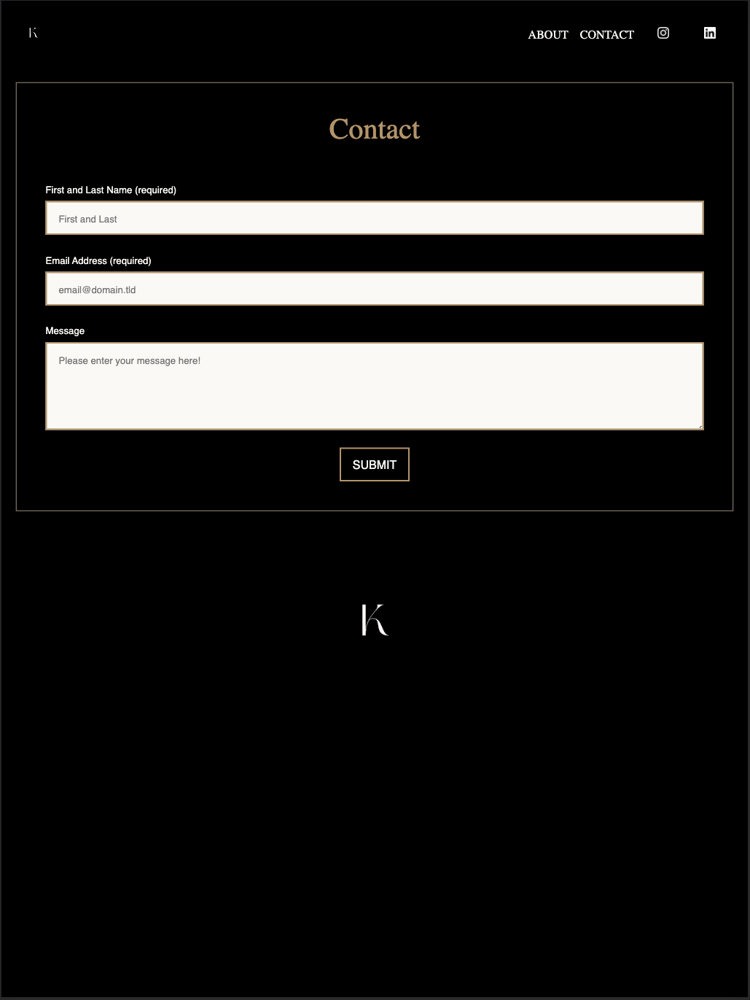

#### Desktop Views

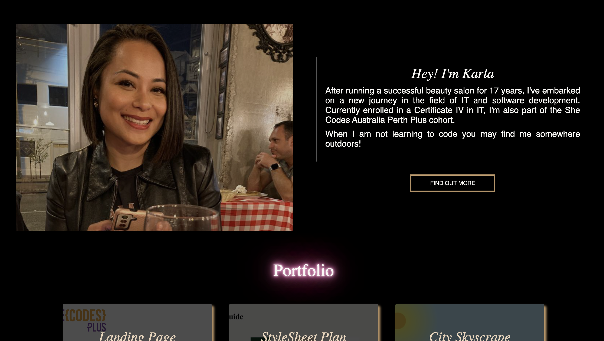

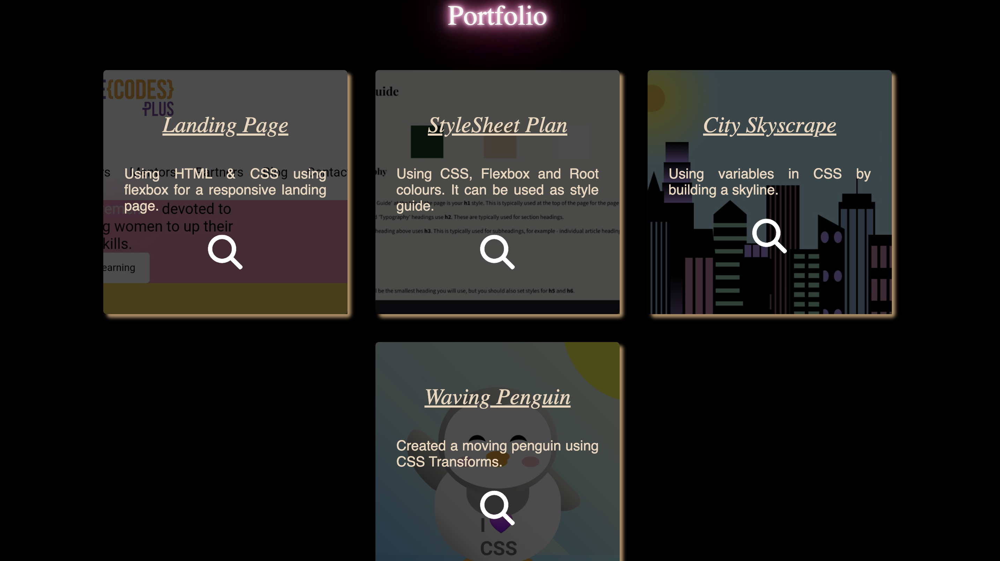

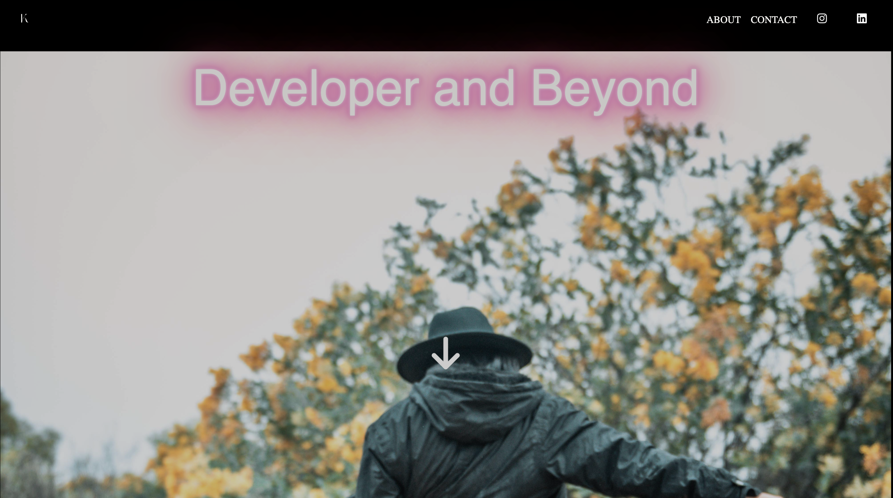

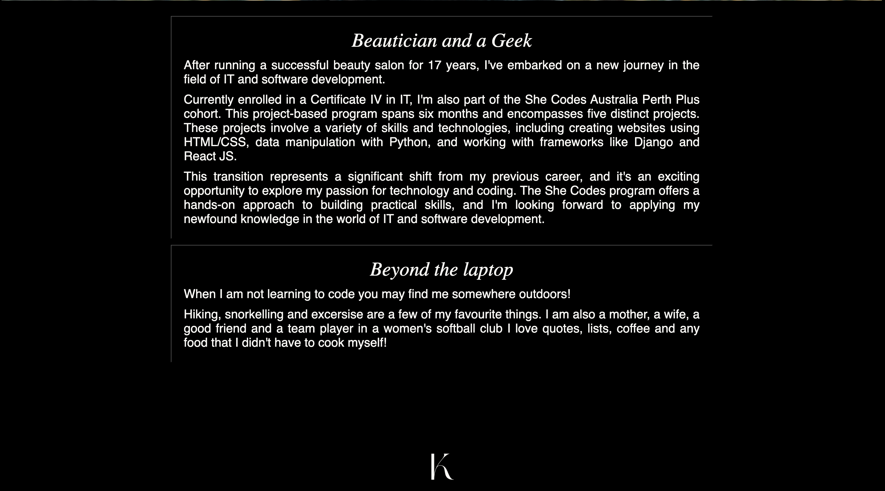

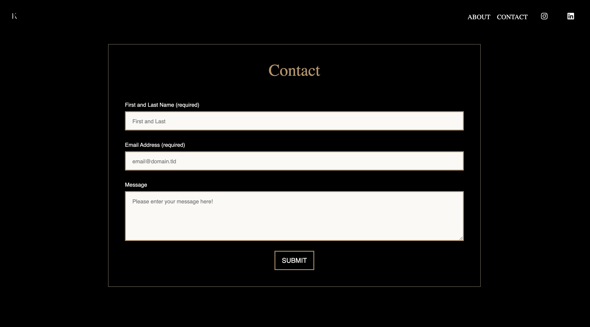

